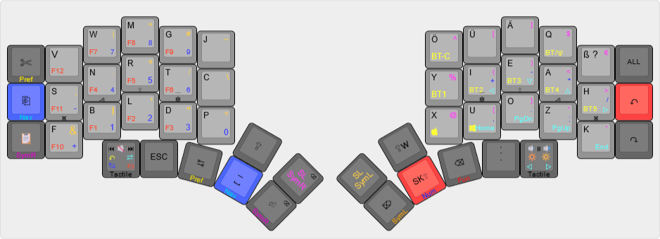

# zmk-config

This is my personal [ZMK firmware][1] configuration for my 50-key [Kyria][2] keyboard.

## Keymap layout

**This graphic may be out of date in relation to the code, the latest version can be viewed [here][3].*

Graphic produced with [@ijprest/keyboard-layout-editor][4].

[1]: https://github.com/zmkfirmware/zmk
[2]: https://blog.splitkb.com/blog/introducing-the-kyria
[3]: http://www.keyboard-layout-editor.com/#/gists/4662659792c4e4f81f1f944e14d51aee
[4]: https://github.com/ijprest/keyboard-layout-editor
